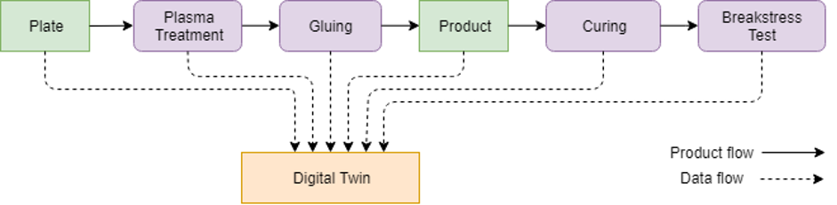
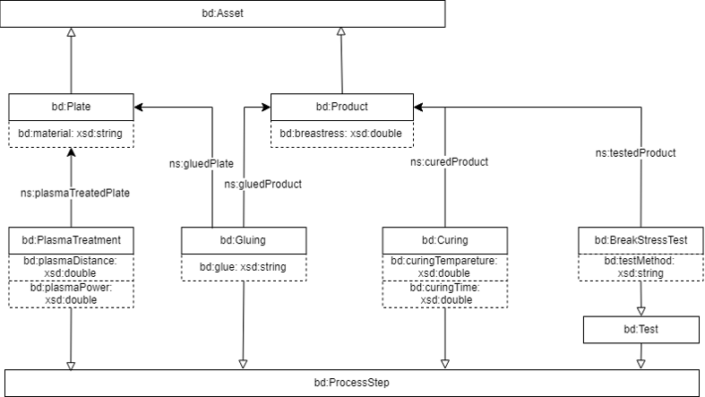
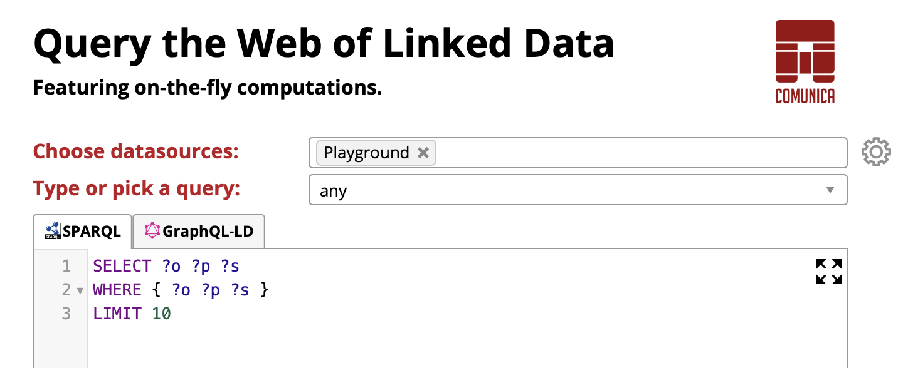

# TUTORIAL: building a digital twin using a knowledge graph

[Part A](#user-content-part-a) / [Part B](#user-content-part-b)

## Prerequisits

For this tutorial, you need:
- a basic understanding of working with a command line;
- some familiarity with query languages;
- some familiarity with programming (scripting) languages.

## Introduction

Digital twins are digital representations of physical objects or processes that integrate data about the object or process. The data often originates from different data sources at different points in time. The digital twin can be questioned on certain characteristics of the physical object or process, in order to answer potentially complex questions that are of value to the user of the digital twin.
In this tutorial, we will be using such a digital twin that represents a simple production process for bonding two parts (plates) together into a product. We will question the digital twin on the final quality of the product, which requires relating data from different steps of the process.



The figure above shows the different production steps in the process and the production assets involved. The base plate material enters the production process and is prepared for bonding through cleaning and plasma treatment of the surface. Two plates are chosen to be bonded together with the adhesive (glue) and batches are cured in the oven, resulting in the final product. The final product can be tested for its main product quality indicator: its break stress. During the different production steps, a number of key values are being registered and stored in the digital twin of the complete process.

In order to build the digital twin in this tutorial, we will use a knowledge graph that is able to store all the data regarding the production process and can be interrogated via the SPARQL query language. This knowledge graph consists of two main parts: 
- a data model (i.e. ontology) that expresses the different assets and production steps in the process as well as their relations, and 
- actual data that is gathered during the execution of production steps.

In this tutorial we will make use of the [samples.ttl](samples.ttl) knowledge graph which combines a data model with some production data. A graphical representation of the data model is shown below.



There are two production assets: the base materials (plates) and products (two plates bonded together) and four production steps: plasma treatment, gluing, curing and a break stress test.

## PART A

### A.1: install sparql-otfc

Follow the steps on [sparql-otfc#installation](https://github.com/Flanders-Make-vzw/sparql-otfc#installation) to install the sparql-otfc endpoint and web UI.

### A.2: configure and run

In this tutorial we will use the data in [samples.ttl](samples.ttl). This data is stored in [Turtle](https://www.w3.org/TR/turtle/) syntax, a textual representation of an [RDF](https://www.w3.org/RDF/) graph, and is expressed as triples consisting of a subject, predicate and object. To interrogate the data via the [SPARQL](https://www.w3.org/TR/rdf-sparql-query/) query language, we will load it into a graph database, in this case an in-memory triple store at the sparql-otfc endpoint.

1. Edit `config/default.json` and look for `sources`. Add to the configuration of the source named `playground` an `imports` array linking to `samples.ttl` as shown below. This will load the data in [samples.ttl](samples.ttl) into the `playground` source such that it can be queried.
```json
{
	"type": "n3",
	"name": "playground",
	"imports": [ "./tutorial/samples.ttl" ]
}
```
2. Now run the endpoint and the web UI as outlined on [sparql-otfc#running](https://github.com/Flanders-Make-vzw/sparql-otfc#running).

3. Point a web browser to `http://localhost:3001`. Choose `Playground` as data source (instead of the default `DBPedia`).



### A.3: first queries

Just like our dataset is expressed as triples, a [SPARQL](https://www.w3.org/TR/rdf-sparql-query/) query consists of a set of triple patterns in which each element (the subject, predicate and object) can be a variable (wildcard). Solutions to the variables are then found by matching the patterns in the query to triples in the dataset. As such, we can interrogate a digital twin as a directed graph, by simply resolving triple elements (subjects, predicates and/or objects).

1. As a first experiment, run the default `any` query. This query matches any triple in the dataset and will return some ontological definitions mixed with instance data.

2. Next, try the query below to obtain all product instances. The iris in the result set correspond to resources (products) which consist of bonding two plates together. Note that the `a` predicate in this query is a shortcut for `rdf:type` stating that a resource is an instance of a class.

````sparql
SELECT ?product
WHERE {
	?product a <http://www.flandersmake.be/ontology/dtaw#Product>
}
````

3. The following query selects the two last process steps in a production process (`Curing` and `BreakStressTest`) and returns some properties from these steps: `curingTemperature` and `breakStress`.

````sparql
PREFIX dtaw: <http://www.flandersmake.be/ontology/dtaw#>

SELECT *
WHERE {
	?curing a dtaw:Curing ;
	    dtaw:curedProduct ?product ;
	    dtaw:curingTemperature ?curingTemperature .
  
	?test a dtaw:BreakStressTest ;
	     dtaw:testedProduct ?product ;
	     dtaw:breakStress ?breakStress .
}
````

4. Now refer again to the data model depicted in the introduction to familiarize how products, parts (plates) and process steps are interconnected. Then consider the next query (which will be reused later on) that breaks down a product into its two parts and then collects their `plasmaDistance` and `plasmaPower` properties that were recorded in a `PlasmaTreatment` process step.

````sparql
PREFIX dtaw: <http://www.flandersmake.be/ontology/dtaw#>

SELECT ?product ?plasmaDistanceA ?plasmaPowerA ?plasmaDistanceB ?plasmaPowerB
WHERE {
	?gl dtaw:gluedProduct ?product ;
	    dtaw:gluedPartA ?partA ;
	    dtaw:gluedPartB ?partB .
  
	?pta dtaw:treatedPart ?partA ;
	     dtaw:plasmaDistance ?plasmaDistanceA ;
	     dtaw:plasmaPower ?plasmaPowerA .

	?ptb dtaw:treatedPart ?partB ;
	     dtaw:plasmaDistance ?plasmaDistanceB ;
	     dtaw:plasmaPower ?plasmaPowerB .
}
````

## PART B

After plasma treating, gluing and curing two plates into a product, the product may be lost if it does not pass the break stress test. To avoid this, we want to predict the break stress test in advance. In this part of the tutorial we will compute a prediction of the expected break stress early on in the production process. This data is not part of the knowledge graph and needs to be computed on demand. For simplicity reasons, we will base our prediction on data collected in the first step of the production process where plates receive their plasma treatment: plasma distance and plasma power.

### B.1: add a computed predicate

1. Create a file `predictedBreakStress.js` in the `src/predicates` folder. The skeleton of this file should look as follows:

```javascript
import Predicate from '../predicate.js';

export default class PredictedBreakStressPredicate extends Predicate {
	static iri = 'http://www.flandersmake.be/ontology/dtaw#predictedBreakStress';

	static async compute(query, context, engine) {
		let triples = [];
		// to do
		return triples;
	}
}
````
We are creating a `PredictedBreakStressPredicate` class with an `iri` and `compute` function. The `iri` identifies the predicate and will be used in SPARQL queries later on. In the `compute` function, we will by default generate a predicted break stress for each sample in the knowledge graph. The compute function will return those predictions as triples with subject `s`, predicate `p` and object `o`, e.g.:

 ```javascript
{
	s: 'http://a_sample', // the iri of a sample
	p: 'http://www.flandersmake.be/ontology/dtaw#predictedBreakStress', // the iri defined in this class
	o: 123 // the calculated predicted break stress
}
````

2. Next we add function at the bottom of `predicatedBreakStress.js` that simulates a calculation for predicated break stress. This function will be based on statistical models derived from earlier experiments, but for the sake of simpliclity we will use a dummy calculation as follows:
 ```javascript
function calculatePredictedBreakStress(plasmaDistanceA, plasmaDistanceB, plasmaPowerA, plasmaPowerB) {
	let pbs = ((plasmaPowerA + plasmaPowerB) * 4.56) / ((plasmaDistanceA + plasmaDistanceB) * 12.3);
	return Math.round(pbs);
}
````
3. Note that this function takes as input the properties from a plasma treatment step selected by the last query in [A.3: first queries](a3-first-queries):
````sparql
PREFIX dtaw: <http://www.flandersmake.be/ontology/dtaw#>

SELECT ?product ?plasmaDistanceA ?plasmaPowerA ?plasmaDistanceB ?plasmaPowerB
WHERE {
	?gl dtaw:gluedProduct ?product ;
	    dtaw:gluedPartA ?partA ;
	    dtaw:gluedPartB ?partB .
  
	?pta dtaw:treatedPart ?partA ;
	     dtaw:plasmaDistance ?plasmaDistanceA ;
	     dtaw:plasmaPower ?plasmaPowerA .

	?ptb dtaw:treatedPart ?partB ;
	     dtaw:plasmaDistance ?plasmaDistanceB ;
	     dtaw:plasmaPower ?plasmaPowerB .
}
````
Save this query in a file `predictedBreakStress.sparql` in the `queries` folder so we can easily integrate in our code.

4. We will now use the `calculatePredicatedBreakStress` function and the `predictedBreakStress.sparql` query from the previous two steps inside the `compute` function as follows:

````javascript
static async compute(query, context, engine) {
	let triples = [];
	// load predicate query
	let q = this.read('./queries/predictedBreakStress.sparql');
	// execute predicate query and trigger callback for each matching sample
	await engine.run(q, context, data => {
		// calculate predicated break stress from sample properties
		const pbs = calculatePredictedBreakStress(data.plasmaDistanceA, data.plasmaDistanceB,
			data.plasmaPowerA, data.plasmaPowerB);
		// store (sample, :predicatedBreakStress, value)
		triples.push({
			s: Predicate.iri(data.product),
			p: Predicate.iri(PredictedBreakStressPredicate.iri),
			o: pbs
		});
	});
	return triples;
}
````

Update the `compute` function in `predicatedBreakStress.js` accordingly.

5. Restart the sparql-otfc endpoint and verify that `Loaded compute predicate plugin for <http://www.flandersmake.be/ontology/dtaw#predictedBreakStress>` is shown in the console output.

### B.2: query a computed predicate

With the computed predicate known to the endpoint, it can now be used just like an ordinary predicate in SPARQL queries:

````sparql
PREFIX dtaw: <http://www.flandersmake.be/ontology/dtaw#>

SELECT ?product ?pbs
WHERE {
	?product dtaw:predictedBreakStress ?pbs
}
````
Of course, it is also possible to mix regular predicates and computed predicates in a query.

### B.3: apply optimizations

Consider the following query where we select the predicted break stress for just one product:
````sparql
PREFIX dtaw: <http://www.flandersmake.be/ontology/dtaw#>

SELECT ?product ?pbs
WHERE {
	?product dtaw:predictedBreakStress ?pbs .
	FILTER(?product = <http://www.flandersmake.be/ontology/dtaw#i/Product/SamPhase1_0>)
}
````
Still, our `compute` function will calculate predictions for each product in the knowledge graph since it is unaware of the query asked by a user. By merging constraints from the user query (the query listed above) into the predicate query (`predictedBreakStress.sparql`) we can optimize the calculations needed (i.e. just one calculation in this example). This is achieved by adapting the `compute` function as follows (and restarting the endpoint):
````javascript
let q = this.read('./queries/predictedBreakStress.sparql');
// merge predicate query with user query
q = this.merge(q, query, 'product', PredictedBreakStressPredicate.iri);

````
The `merge` function will copy the `FILTER` expression from the user query into the `predicatedBreakStressPredicate.sparql` query at runtime which will now only return one product with plasma properties and hence only one triple will be calculated.
